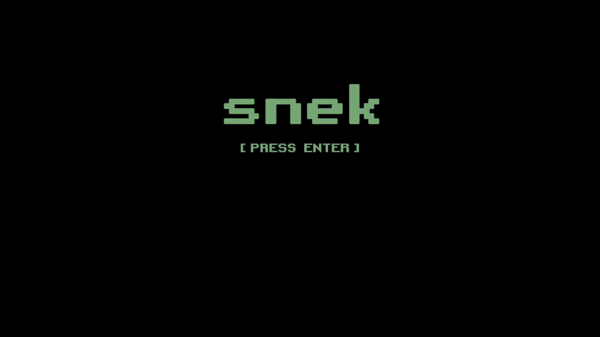

# snek!

A simplified C++ remake of `snek!` using DirectX 11 and Win32.

Snake is somewhat a rite of passage, and I originally created `snek!` here. This is a super simple remake as an intro to DX11 and the Win32 API.
||||||| parent of f7b53fb (Add MSBuild status badge to README)
A simplified C++ remake of `snek!` using DirectX 11.

:warning: TODO: Add link to the original snek when the repo is up!

## Requirements

- C++20
- Windows 10+
- Visual Studio 2022 (or simply the [Build Tools for Visual Studio 2022](https://visualstudio.microsoft.com/downloads/#build-tools-for-visual-studio-2022)).
- A graphics card that supports DX11

## How to Build & Run

You can build the solution using either Visual Studio or from the command line with MSBuild.

### Visual Studio

Building the solution should work as expected. Wait for the solution to load and press the big ol' play button (or ctrl-F5 if you are lazy like me).

### MSBuild from the Developer Command Prompt

You can build the solution with MSBuild from a Developer Command Prompt, or from Powershell if you have the standalone Build Tools for VS 2022 installed and don't want to launch Visual Studio.

Run `MSBuild.exe` in the root of the project (automatically builds the `.sln` file in the current dir) and then launch the game with `.\x64\Debug\Snek.exe`.

## How to Play

:snake: Use the arrow keys to move snek around the screen.

:apple: Eat the apples and your tail will grow longer.

:rock: Avoid the walls and rocks.

There is no fancy-pants screen management or menu in this simplified version. If your snek dies, restart the program.

